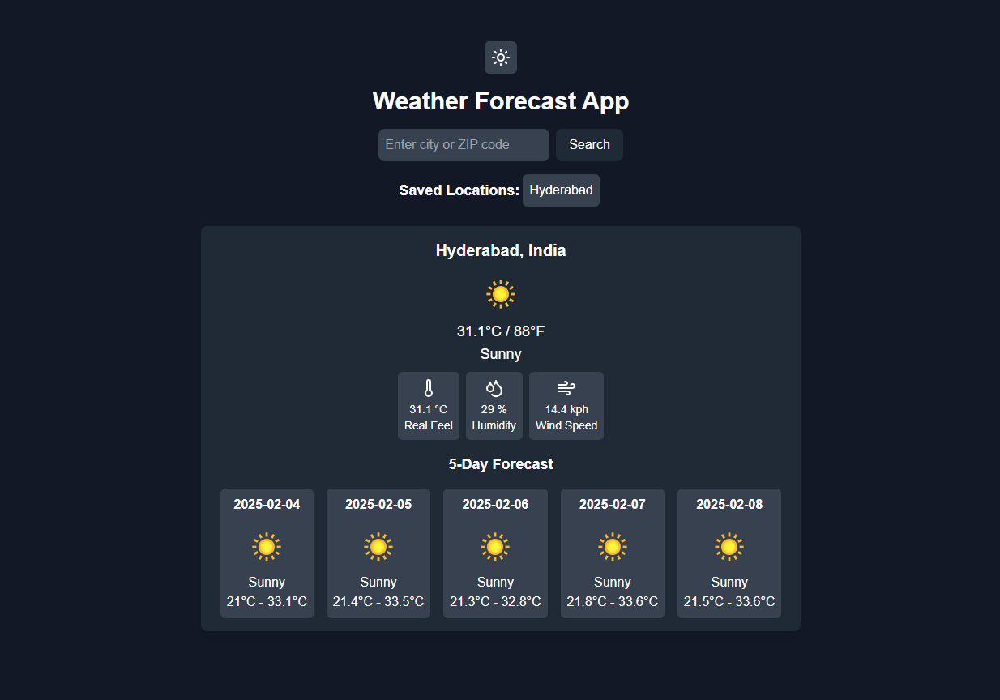

Weather Forecasting App

A weather forecasting app built with Next.js, TypeScript, and Tailwind CSS that allows users to view the current weather and forecasts for various locations worldwide.

Screenshot
Here’s a preview of the app:

Features
Current Weather Information: Display current weather details including temperature, humidity, wind speed, and weather description.
Weather Forecast: View a 7-day weather forecast for any selected city.
Search Locations: Search for cities by name and get the weather details.
Responsive Design: Optimized for mobile and desktop views using Tailwind CSS.
Technologies Used
Next.js: A React framework for building static and dynamic websites.
TypeScript: A typed superset of JavaScript that provides static typing.
Tailwind CSS: A utility-first CSS framework for creating responsive designs.
Weather API: Fetch real-time weather data from a reliable weather service API.
Setup and Installation
To run this project locally, follow the steps below:

Prerequisites
Make sure you have the following installed on your machine:

Node.js (>= 14.x.x)
npm or yarn (depending on your package manager preference)
Steps

1. Clone this repository:
   git clone https://github.com/md-sameer1/weather-app.git
   cd weather-app

2. Install dependencies:
   Using npm: npm install Or using yarn: yarn install

3. Create a .env.local file in the root directory and add your Weather API key:
   NEXT_PUBLIC_WEATHER_API_KEY=your-api-key

4. Run the development server:
   npm run dev
   Or
   using yarn: yarn dev

5. Open your browser and go to http://localhost:3000 to see the app in action.

How to Use
On the homepage, you’ll find a search bar where you can enter a city name.
Upon entering a city name, the app will fetch and display the current weather and a 7-day forecast for that city.
The weather data includes temperature, humidity, wind speed, and a description of the weather (e.g., sunny, cloudy, etc.).
API Used
This app fetches weather data using the OpenWeatherMap API (or another similar weather API) for retrieving current and forecast weather data.

API documentation: https://openweathermap.org/api

You can check out [the Next.js GitHub repository](https://github.com/vercel/next.js) - your feedback and contributions are welcome!

## Deploy on Vercel

The easiest way to deploy your Next.js app is to use the [Vercel Platform](https://vercel.com/new?utm_medium=default-template&filter=next.js&utm_source=create-next-app&utm_campaign=create-next-app-readme) from the creators of Next.js.

Check out our [Next.js deployment documentation](https://nextjs.org/docs/pages/building-your-application/deploying) for more details.
